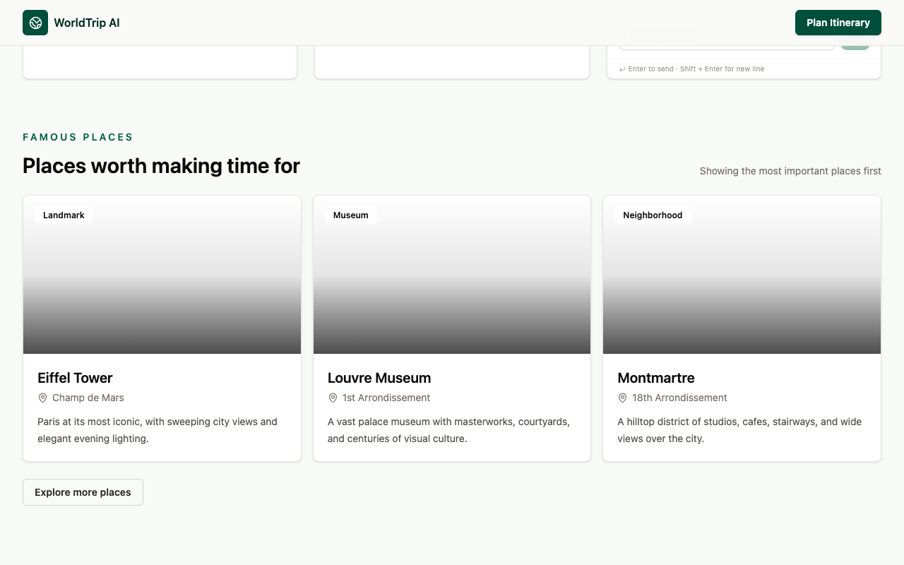
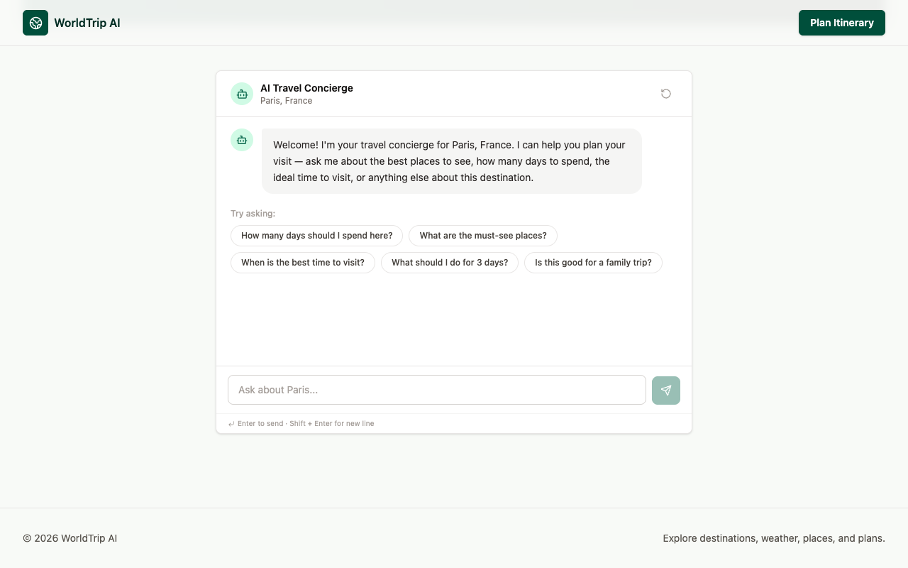
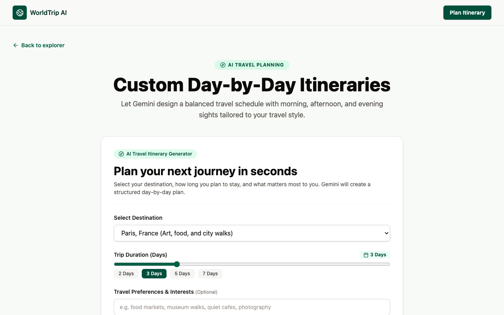
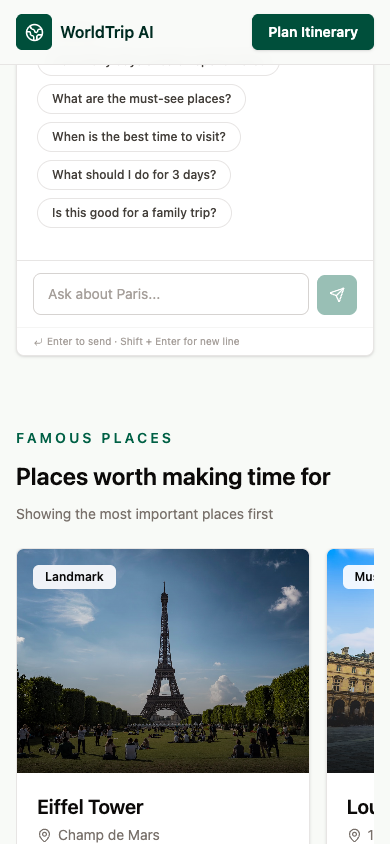

# WorldTrip AI — Design-Led Travel Experience

WorldTrip AI is a modern, design-led travel exploration and planning platform built with React, Vite, and Google Gemini. It combines curated global destination guides, live weather observations, location awareness, an interactive destination AI concierge, and an AI-powered day-by-day itinerary generator into a unified, high-aesthetic web application.

The experience is centered around purposeful exploration: travelers can discover destinations tailored to their interests, check real-time weather conditions, explore iconic landmarks with dynamic photography, converse with a destination-specialized AI assistant, and instantly generate structured, practical travel schedules.

---

## Screenshots

### 1. Hero & Destination Discovery (Desktop)

*Cinematic video backdrop with ambient lighting, immediate destination exploration, and real-time category filtering.*

---

### 2. Destination Guide & Landmark Insights

*In-depth travel guide featuring editorial overviews, key highlights, best time to visit, practical tips, and famous place cards with dynamic imagery.*

---

### 3. AI-Powered Day-by-Day Itinerary Planner

*Structured itinerary generator configuring customizable trip lengths (1–10 days) and traveler preferences, outputting partitioned morning, afternoon, and evening activity blocks.*

---

### 4. Fully Responsive Mobile Experience
<p align="center">
  
</p>
<p align="center"><em>Adaptive, single-column mobile interface with fluid touch interactions and responsive navigation.</em></p>

---

## Features

- **Cinematic Video Hero**: High-definition looping video background with dual gradient vignettes, responsive typography, and accessible scroll cues.
- **Destination Explorer**: Instant client-side search across destinations, paired with interactive region filters (*Europe, Asia, North America, Africa*) and travel category chips (*Culture, City, Nature, Adventure*).
- **Dedicated Destination Detail Pages**: Deep-dive itineraries and practical travel intelligence for curated world capitals and regions (`/destinations/:id`).
- **Visual Famous Places**: Highlighted landmark cards with geographic tagging, rich editorial context, and dynamic photo integration.
- **Location Awareness & Distance Sorting**: Built-in browser Geolocation API integration alongside manual city search with mathematical Haversine distance calculations to show how far each destination is from the user.
- **Live Weather Conditions**: Instant atmospheric temperature, feels-like readings, humidity, and wind velocity tailored to the destination's latitude and longitude.
- **Conversational AI Destination Concierge**: Multi-turn chat assistant powered by Gemini with pre-configured contextual travel prompts and automatic session reset on destination changes.
- **Structured Day-by-Day Itinerary Generator**: Custom planning engine that enforces strict JSON schemas on Gemini to generate realistic morning, afternoon, and evening itineraries complete with local insider tips.
- **Dynamic Image Sourcing & In-Memory Caching**: Eliminates hardcoded local assets by querying Pexels dynamically with automated gradient fallbacks and client-side memory caching.
- **Resilient States & Accessibility**: Semantic HTML5 landmark structure, animated loading skeletons, pulsing placeholders, and graceful error alerts for network or API downtimes.

---

## APIs & External Services

| Service | Purpose | Where Used in Application |
|---|---|---|
| **Google Gemini API** | Multi-turn conversational travel concierge and structured JSON itinerary generation | [`src/services/gemini.js`](src/services/gemini.js), powering [`ChatBot.jsx`](src/components/ChatBot.jsx) and [`ItineraryPlanner.jsx`](src/components/ItineraryPlanner.jsx) |
| **OpenWeather API** | Current live weather data (temperature, wind, humidity, conditions) | [`src/services/weather.js`](src/services/weather.js), rendered in [`WeatherCard.jsx`](src/components/WeatherCard.jsx) |
| **Open-Meteo API** | Zero-config, open-access fallback weather service ensuring continuous live weather availability | [`src/services/weather.js`](src/services/weather.js) fallback layer |
| **Pexels API** | Dynamic high-resolution photography for destinations and famous places | [`src/services/images.js`](src/services/images.js), rendered in [`ImageFromSource.jsx`](src/components/ImageFromSource.jsx) |
| **OpenStreetMap Nominatim** | Forward geocoding for manual location detection | [`src/hooks/useLocation.js`](src/hooks/useLocation.js), used in [`LocationPanel.jsx`](src/components/LocationPanel.jsx) |

---

## Tech Stack

- **Framework**: [React 19](https://react.dev/) + [Vite](https://vite.dev/)
- **Routing**: [React Router v7](https://reactrouter.com/) (Declarative client-side routing)
- **Styling**: [Tailwind CSS v4](https://tailwindcss.com/)
- **AI SDK**: [`@google/genai`](https://www.npmjs.com/package/@google/genai) (Official Google GenAI SDK)
- **Icons**: [Lucide React](https://lucide.dev/)
- **Typography**: Inter / Modern System Font Stack

---

## Local Setup

### Prerequisites
- **Node.js** (v18.0.0 or higher recommended)
- **npm** (v9.0.0 or higher)

### Installation

1. **Clone the repository**:
   ```bash
   git clone git@github.com:prakhartripath0001/travel-application.git
   cd travel-application
   ```

2. **Install project dependencies**:
   ```bash
   npm install
   ```

3. **Configure Environment Variables**:
   Create a local `.env` file in the root directory:
   ```bash
   cp .env.example .env
   ```

   Add your API keys to `.env`:
   ```env
   VITE_OPENWEATHER_API_KEY=your_openweather_api_key_here
   VITE_PEXELS_API_KEY=your_pexels_api_key_here
   VITE_GEMINI_API_KEY=your_gemini_api_key_here
   ```
   > *Note: Open-Meteo acts as an automatic fallback if an OpenWeather key is not provided.*

4. **Start the development server**:
   ```bash
   npm run dev
   ```

5. **Open the application**:
   Navigate to [http://localhost:5173](http://localhost:5173) in your browser.

### Building for Production

To create an optimized production build:
```bash
npm run build
```

To preview the production build locally:
```bash
npm run preview
```
